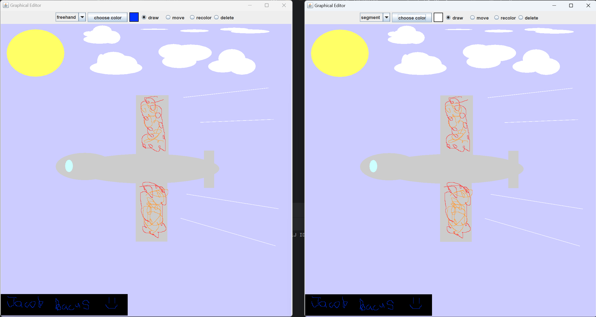

# Collaborative Graphical Editor

## Overview

This project is a collaborative graphical editor where multiple users can create, modify, and delete shapes on a shared canvas in real time. Using a client-server architecture, the editor ensures updates are synchronized across all connected users. Shapes like ellipses, rectangles, segments, and polylines can be drawn and manipulated through an intuitive graphical interface.

---

## Key Features

### Shape Support

- **Ellipse**: Customizable size and color.
- **Rectangle**: Customizable size and color
- **Segment**: Straight lines with adjustable endpoints and color.
- **Freehand**: Connected sequences of lines smoothly tracing the path of the mouse.

### Core Actions

- **Draw**: Add shapes to the canvas.
- **Recolor**: Change the color of a specific shape.
- **Move**: Reposition existing shapes.
- **Delete**: Remove shapes permanently.

### Real-Time Collaboration

- Multiple users can connect to the canvas simultaneously.
- Updates are synchronized instantly, ensuring consistency for all users.

---

## System Components

### Client

- Provides a graphical interface for users.
- Includes tools for drawing, selecting, and editing shapes.

### Server

- Manages the shared canvas state.
- Ensures synchronization across all clients.

### Communication

- Facilitates interaction between the server and clients using a structured protocol.
- Messages specify actions like `draw`, `move`, and `delete`, along with shape details.

---

## How It Works

1. **Start the server** to host the shared canvas.
2. **Connect clients** to the server. Each client represents a user editing the canvas.
3. **Draw and edit shapes** using the tools in the graphical interface.
4. **Real-time synchronization** ensures that all users see the same updates.

---

## Enjoy!

---

## Acknowledgments

Developed as part of the Dartmouth CS10 curriculum, Winter 2024.

---

## License

This project is distributed under the MIT License. Refer to the LICENSE file for detailed terms and conditions.

